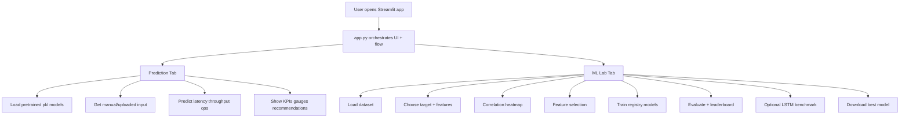
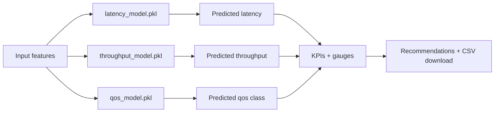
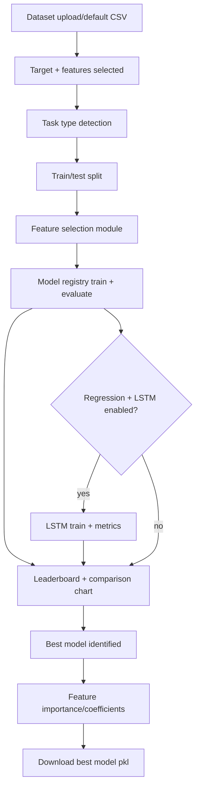
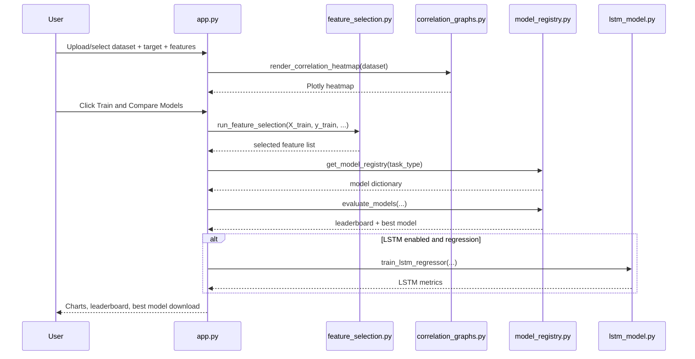

# 5G ML System Explanation Guide

This document explains what the project is doing, how each file participates, and how data moves through prediction and training workflows.

## 1) What This System Does

The app has two major workflows:

1. Performance Prediction tab
- Uses pre-trained models to predict:
  - Latency (regression)
  - Throughput (regression)
  - QoS class (classification)
- Shows gauges, summary KPIs, recommendations, and downloadable prediction results.

2. ML Lab tab
- Trains and compares many models on your dataset.
- Runs feature selection.
- Displays correlation heatmaps.
- Optionally trains an LSTM model (for regression targets only).
- Lets you download the best classical model.

## 2) High-Level Architecture

## 3) File Responsibilities

### Main app
- app.py
  - Streamlit UI and orchestration
  - Calls analysis and model modules

### Analysis modules
- analysis/feature_selection.py
  - Runs feature selection methods:
    - Mutual Information
    - F-Score
    - RFE
- analysis/correlation_graphs.py
  - Builds correlation heatmap from numeric columns
- analysis/explainability.py
  - Generates optional SHAP global feature-importance plots
- analysis/optimization_strategies.py
  - Creates precise, target-based optimization strategy plans
- analysis/research_plots.py
  - Produces regression/classification diagnostics and ROC-AUC indicators

### Model modules (one model per file)

Regression/classification classical models:
- models/linear_regression_model.py
- models/logistic_regression_model.py
- models/random_forest_regressor_model.py
- models/random_forest_classifier_model.py
- models/gradient_boosting_regressor_model.py
- models/gradient_boosting_classifier_model.py
- models/svr_model.py
- models/svc_model.py
- models/knn_regressor_model.py
- models/knn_classifier_model.py
- models/mlp_regressor_model.py
- models/mlp_classifier_model.py

Deep learning model:
- models/lstm_model.py
  - TensorFlow availability check
  - LSTM training function for regression

Registry and evaluation:
- models/model_registry.py
  - get_model_registry(task_type)
  - evaluate_models(...)
  - Returns leaderboard + best model

## 4) Prediction Flow (Pretrained)

Pretrained model locations used by the app:
- artifacts/pretrained/latency_model.pkl
- artifacts/pretrained/throughput_model.pkl
- artifacts/pretrained/qos_model.pkl

## 5) ML Lab Training Flow

## 6) How Model Comparison Works

In models/model_registry.py:

1. get_model_registry(task_type)
- If regression:
  - Linear Regression
  - Random Forest Regressor
  - Gradient Boosting Regressor
  - SVR
  - KNN Regressor
  - Neural Network (MLP Regressor)
- If classification:
  - Logistic Regression
  - Random Forest Classifier
  - Gradient Boosting Classifier
  - SVC
  - KNN Classifier
  - Neural Network (MLP Classifier)

2. evaluate_models(...)
- Trains every model.
- Predicts on test split.
- Computes metrics.
- Sorts results:
  - Regression sorted by R2 descending.
  - Classification sorted by F1 descending.
- Returns best model and full leaderboard.

## 7) Feature Selection Methods

In analysis/feature_selection.py:

1. Mutual Information
- Captures non-linear dependency between feature and target.
- Useful when relationships are not purely linear.

2. F-Score
- Statistical test strength against target.
- Fast and good baseline feature ranking.

3. RFE (Recursive Feature Elimination)
- Iteratively removes weaker features using an estimator.
- More model-aware but can be slower.

## 8) Correlation Graphs

In analysis/correlation_graphs.py:

- Uses numeric columns only.
- Computes Pearson correlation matrix.
- Renders heatmap with values from -1 to 1.

Interpretation:
- Near 1: strong positive relation.
- Near -1: strong negative relation.
- Near 0: weak linear relation.

Note:
- Correlation does not imply causation.
- Strongly correlated features may indicate redundancy.

## 9) Example Walkthrough

### Example A: Predictive use case

Input (manual or uploaded):
- signal_strength=-85
- sinr=15
- connected_users=100
- bandwidth_mhz=20
- packet_loss=1.0
- jitter=5.0
- mobility_speed=20.0

Output:
- predicted_latency_ms
- predicted_throughput_mbps
- qos_classification
- KPI cards and recommendations

### Example B: Training use case (latency regression)

1. Open ML Lab tab.
2. Use default dataset data/5g_network_data.csv.
3. Set target column to latency.
4. Select desired features.
5. Choose feature selection method (for example Mutual Information).
6. Click Train and Compare Models.
7. Review leaderboard (R2/MAE/RMSE).
8. Optionally enable LSTM and compare.
9. Download best classical model.

### Example C: Training use case (QoS classification)

1. Set target column to qos_class.
2. Task type switches to classification.
3. Train and compare.
4. Review Accuracy/F1/Precision/Recall.
5. Download best classifier model.

## 10) Sequence Diagram (ML Lab)

## 11) Add a New Model (Pattern)

To add a new model cleanly:

1. Create one file in models/, for example models/xgboost_regressor_model.py.
2. Implement a function that returns a pipeline, for example xgboost_regressor_pipeline().
3. Import and register it inside models/model_registry.py under regression or classification.
4. Run the app and compare on the leaderboard.

## 12) Practical Notes

- LSTM runs only when TensorFlow is available and task is regression.
- Classical model download uses joblib and stores a pipeline (preprocessing + estimator).
- If your dataset has missing values, pipelines handle them using median imputation.
- For classification with text labels, labels are encoded before training.
- For research reporting, you can download leaderboard, diagnostics, SHAP importance, optimization plan, and experiment summary CSV files.

---

Implemented: model explainability plots using SHAP in analysis/explainability.py using the same modular style.
